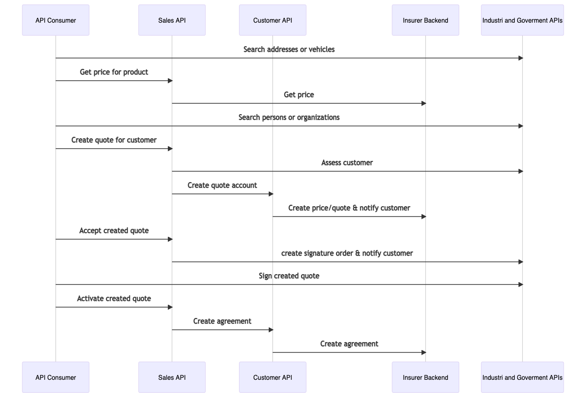

# Cirruz
The open insurance api specification in the sky.

# Purpose
* Create an open *Sales and Customer API* for insurance.
* Be inspired by openinsurance.io and [OMG property and casualty](https://www.omg.org/spec/PC/1.0/About-PC/).
* Follow [Zalando RESTful API and Event Guidelines](https://opensource.zalando.com/restful-api-guidelines/).
* Deploy to all major cloud platforms: [Azure](https://azure.microsoft.com/), [AWS](https://aws.amazon.com/), [GCP](https://cloud.google.com/) and [Alibaba](https://alibabacloud.com/) via [terraform.io](https://www.terraform.io/)

# Sales API
* Get prices for configured insurance products.
* Issue quotes to a named person or organization.
* Accept, Sign or Activate a quote.
* Integrate to *National Goverment and Industry APIs*. 
* Comply with national customer regulations.

# Customer API
* Create a quote account.
* Get customer agreements and documents.
* Create a payment agreement.
* Merge a quote account with an exsisting account.
* Grant and revoke accounts access to
  * other personal parties like relatives
  * staff or 3. party organizational like insurance partners, brokers 
